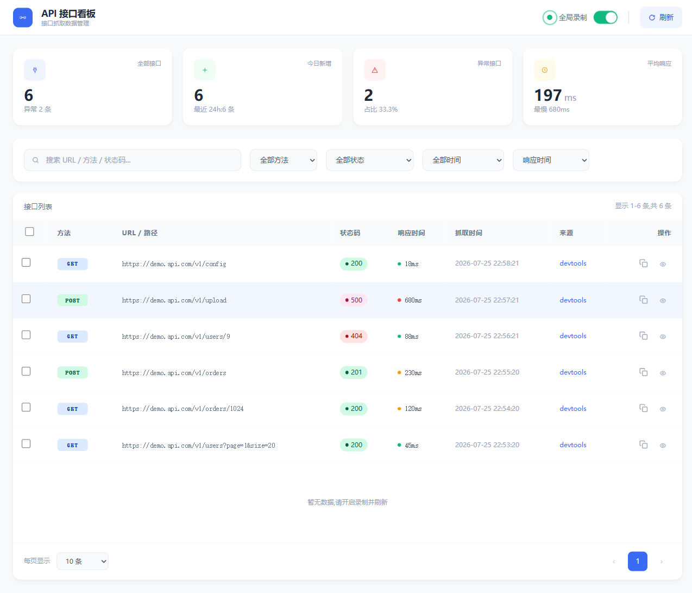
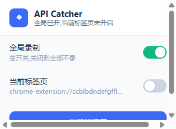
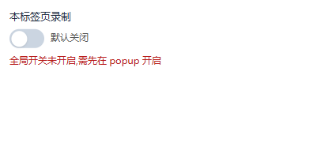
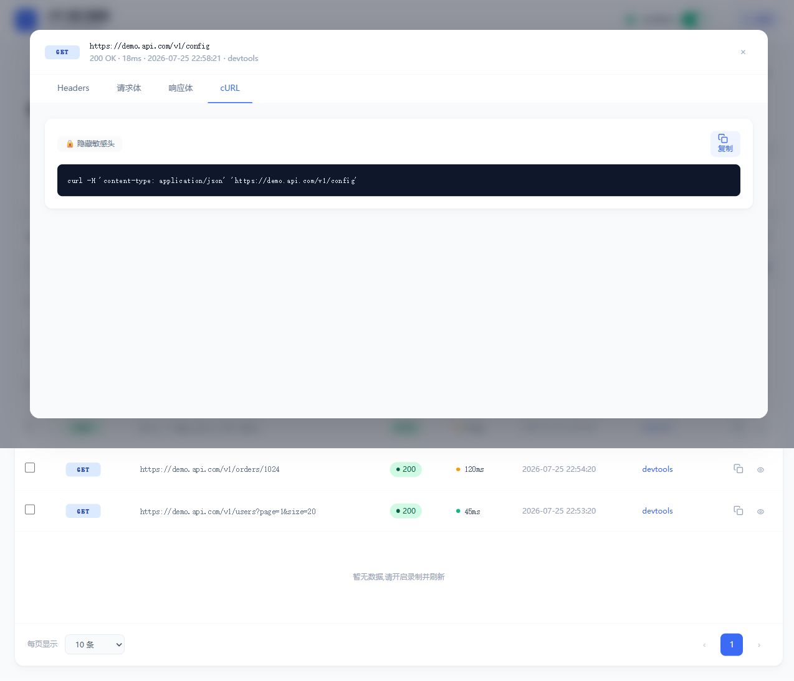

# API Catcher

> 一个 Chrome MV3 扩展:抓取网页调用的接口(fetch / XHR),生成可复用的 **cURL**,支持搜索筛选与多格式**批量导出**(Postman / JMeter / HAR / JSON),录制时列表**实时刷新**。适合接口调试、联调、问题复现。

## 功能特性

- 🔌 **双路径抓取**:页面内 hook(inject,MAIN world)与 DevTools 面板(devtools,网络层)同时工作,互为补充。
- 📋 **cURL 生成**:一键把请求转为 cURL 命令;敏感头(Cookie / Authorization 等)用按钮切换显示/隐藏,默认展示。
- 📤 **批量导出**:勾选多条(跨页保留)→ 导出为 Postman v2.1 / JMeter `.jmx` / HAR 1.2 / JSON;无勾选时导出当前筛选结果。
- 🔍 **搜索 + 筛选**:按 URL / 方法 / 状态码 / 响应时间筛选;时间筛选支持「最近 N 小时」与**自定义时间段**(datetime 选择)。
- ⏺️ **录制开关**:全局开关 + 每标签页开关,两者默认**关闭**(白名单心智);popup、DevTools 面板、管理页三处可控制。
- ⚡ **实时刷新**:录制时新请求自动追加到列表(智能暂停——翻页或筛选时不跳页,改提示条提示)。
- 🗂️ **二进制 body 捕获**:FormData / Blob / ArrayBuffer 等二进制请求体以 base64 保存,cURL 与导出均支持。
- 🧹 **去重**:同一请求被 inject + devtools 双抓时自动合并(响应体/请求头更完整者优先,保留 devtools 的 Cookie 等完整头)。



## 安装

1. 下载或 clone 本仓库到本地。
2. 打开 Chrome,地址栏输入 `chrome://extensions`。
3. 右上角开启**「开发者模式」**。
4. 点**「加载已解压的扩展程序」**,选中本仓库根目录(含 `manifest.json` 的目录)。
5. 扩展图标出现在工具栏,安装完成。

> 最低 Chrome 111+(MV3)。

## 使用流程

### 1. 开启录制

录制采用**全局 AND 标签页**双开关(都默认关闭,需手动开):

- **popup**:点扩展图标 → 开「全局录制」+「当前标签页录制」。
  
- 或 **DevTools 面板**:在目标页 F12 → 找到「API Catcher」面板 → 开「本审查标签页开关」。
  
- 或 **管理页**右上角的全局开关。

### 2. 抓接口

在目标网页正常浏览、触发接口调用。抓到的请求会进入管理页。

> **想看到 Cookie 等浏览器自动加的头**:务必在该标签页 **F12 开 API Catcher 面板**(走 devtools 路径,网络层抓取)。纯页面 hook(inject 路径)受浏览器安全限制,看不到浏览器自动附加的 Cookie;双抓后去重合并会补全。

### 3. 打开管理页

点扩展图标 →「打开管理页」,或直接访问 `chrome-extension://<扩展ID>/src/manage/manage.html`。

管理页提供:
- 统计卡片(总数 / 今日 / 异常 / 平均响应时间)
- 搜索 + 多维筛选(含自定义时间段)
- 接口列表(方法 / URL / 状态 / 响应时间 / 抓取时间 / **来源** / 操作)

### 4. 复制 cURL / 查看详情

- 列表行内 **复制图标**:一键复制该请求的 cURL(默认含敏感头)。
- **眼睛图标**:打开详情 Modal,可查看 Request/Response Headers、请求体、响应体;**cURL 标签页**展示 cURL,可用「🔒 隐藏敏感头 / 🔓 显示敏感头」按钮切换,复制按当前状态。



### 5. 批量导出

- 勾选若干行(首列 checkbox,跨页保留),底部**批量操作条**浮出。
- 点 `Postman` / `JMeter` / `HAR` / `JSON` 导出选中项;未勾选时导出当前筛选结果。
- 文件下载为 `api-catcher-<格式>-<时间戳>.<扩展名>`。

## 两条抓取路径说明

| 路径 | 触发方式 | 能看到 Cookie 吗 | 说明 |
|---|---|---|---|
| **inject** | 自动(页面 JS hook) | ❌ | 在 MAIN world hook fetch/XHR,轻量无感;但浏览器自动加的 Cookie 在 JS 层不可见 |
| **devtools** | F12 开 API Catcher 面板 + 本标签页开关 | ✅ | DevTools 协议在网络层抓取,请求头完整(含 Cookie) |

同一请求被两条路径抓到时,去重合并:**响应体或请求头更完整者优先**(devtools 的完整头会合并进 inject 版)。「来源」列显示最终合并来源。

## 技术架构

- **MV3 service worker** 处理消息、录制状态、去重、写库。
- **IndexedDB** 双表:`requests`(主表,含 by-url / by-timestamp 索引)+ `bodies`(大/二进制 body 拆分表)。
- **去重真相源**:IndexedDB `by-url` 索引查询(非内存),解决并发竞态与 SW 重启重复。
- **纯逻辑层**(`src/logic/`:base64 / curl / exporters / db 查询 / filter / normalize / recording)无 DOM 依赖,可单测。
- **管理页** Tailwind 预编译 + SVG 图标 + 外联 JS(符合 MV3 CSP,无内联/CDN)。

## 开发

```bash
# 跑单元测试(vitest,纯逻辑层)
npm test

# 改了 manage.html / manage.js 的 Tailwind class 后,必须重编译 CSS
npm run build:css

# 集成测试(playwright headed,需本机 chromium-1223 ↔ playwright@1.60.0)
PLAYWRIGHT_SKIP_BROWSER_DOWNLOAD=1 node test/integration/phase3-verify.mjs
```

## 项目结构

```
src/
  background/   service worker + IndexedDB 封装(db.js)+ 去重
  inject/       MAIN world hook fetch/XHR(inject.js)+ 桥接(content.js)
  devtools/     DevTools 面板(panel.js)
  popup/        工具栏 popup(全局+标签页开关)
  manage/       管理页(表格+Modal+筛选+cURL+导出)
  logic/        纯逻辑(base64/curl/exporters/filter/normalize/recording)
test/           vitest 单测 + integration/ 集成验证
manifest.json  MV3 清单
```

## 许可

本项目基于 [Apache License 2.0](LICENSE) 开源。
